# Materiaali

Materiaali olettaa, että osaat hyvin kurssin _Tietorakenteet ja algoritmit_ asiat. Voit tarvittaessa käyttää [Tirakirjaa](https://www.cs.helsinki.fi/u/ahslaaks/tirakirja/) näiden asioiden kertaamiseen. Lisäksi materiaali olettaa, että osaat C++-kielen perusteet. Jos et ole käyttänyt ennen C++-kieltä, voit opetella perusteet esimerkiksi [Tie koodariksi -kurssilta](https://tie.koodariksi.fi/cpp/).

Voit käyttää kurssilla halutessasi C++:n sijasta myös Haskell- tai Rust-kieliä, jos olet valmis opettelemaan näihin kieliin liittyviä asioita itsenäisesti. Tämä materiaali on tehty olettaen, että käytössä on C++.

Jos huomaat virheitä tai puutteita materiaalissa, voit lähettää muutosehdotuksen [GitHubin kautta](https://github.com/hy-alon/hy-alon.github.io).

## Kurssin rakenne

Kurssilla on yhteensä 100 tehtävää, jotka jakautuvat kahteen osaan:

* Osa 1 (65 tehtävää) opettaa algoritmien suunnittelua ja tietorakenteiden käyttämistä. Tämä materiaali auttaa näiden tehtävien ratkaisemisessa.
* Osa 2 (35 tehtävää) sisältää vaikeampia tehtäviä, joissa tarvitaan osan 1 tekniikoita. Nämä tehtävät vaativat itsenäistä ongelmanratkaisua ja soveltamista.

**Varoitus: Monet kurssin tehtävistä ovat vaikeita, ja kurssin suorittaminen vaatii paljon työtä ja aikaa.**

## Aloittaminen

Tarvitset kurssilla tekstieditorin, jolla voi kirjoittaa koodia, sekä C++-kääntäjän. Suositeltava kääntäjä on `g++`, joka on käytössä myös CSES-järjestelmässä, johon kurssin tehtävät palautetaan.

Tässä on esimerkkinä C++-ohjelma, joka tulostaa rivin tekstiä:

```cpp
#include <iostream>

using namespace std;

int main() {
    cout << "aybabtu\n";
}
```

Seuraavat komennot kääntävät ja suorittavat ohjelman Linux-ympäristössä:

```
$ g++ test.cpp -o test -O2 -Wall
$ ./test
aybabtu
```

Tässä ohjelman koodi on tiedostossa `test.cpp` ja siitä käännetään binääritiedosto `test`. Komennon lopussa `-O2` on tavallinen koodin optimointitaso ja `-Wall` ilmaisee, että kääntäjä näyttää kaikki varoitukset.

## Syöte ja tuloste

Hyvä tapa lukea syötettä on käyttää `cin`-virtaa. Oletetaan esimerkiksi, että ohjelman tulee lukea ensimmäiseltä riviltä kaksi kokonaislukua `n` ja `k` ja sitten toiselta riviltä `n` kokonaislukua. Tämän voi toteuttaa seuraavasti:

```cpp
int n, k;
cin >> n >> k;
for (int i = 1; i <= n; i++) {
    int x;
    cin >> x;
}
```

Huomaa, että luettavien alkioiden välillä voi olla vapaasti tyhjää tilaa (kuten välilyöntejä ja rivinvaihtoja). Tämän ansiosta sama koodi toimii riippumatta siitä, miten tiedot on jaettu riveille.

Vastaavasti tietoa voidaan tulostaa `cout`-virtaan näin:

```cpp
cout << "aybabtu\n";
int a = 1, b = 2;
cout << a << " " << b << " " << a+b << "\n";
```

Koodin tulostus on seuraava:

```
aybabtu
1 2 3
```

### Tehtävät

* [Weird Algorithm](https://cses.fi/alon/task/1068)
* [Increasing Array](https://cses.fi/alon/task/1094)
* [Two Sets](https://cses.fi/alon/task/1092)
* [Collecting Numbers](https://cses.fi/alon/task/2216)
* [Creating Strings](https://cses.fi/alon/task/1622)

## Vektori ja järjestäminen

C++:n standardikirjasto sisältää monia valmiita tietorakenteita ja algoritmeja. Näistä usein tarvittavia ovat `vector` (muuttuvan kokoinen taulukko) sekä `sort` (tehokas järjestäminen).

### Vektorin luominen

Vektorin käyttäminen vaatii, että koodin alussa on rivi `#include <vector>`. Esimerkiksi seuraava koodi luo vektorin `c`, jonka alkiot ovat `int`-lukuja, ja lisää siihen kolme alkiota:

```cpp
vector<int> v;
v.push_back(1);
v.push_back(2);
v.push_back(3);
```

Vektorin voi myös luoda antamalla suoraan sen sisällön:

```cpp
vector<int> v = {1,2,3};
```

Funktio `size` kertoo, montako alkiota vektorissa on:

```cpp
cout << v.size() << "\n"; // 3
```

Vektorin sisältöä voi käsitellä samalla syntaksilla kuin taulukkoa. Esimerkiksi seuraava koodi muuttaa vektorin ensimmäistä alkiota:

```cpp
vector<int> v = {1,2,3};
cout << v[0] << "\n"; // 1
v[0] = 5;
cout << v[0] << "\n"; // 5
```

### Vektorin läpikäynti

Vektorin alkiot voi tulostaa for-silmukalla näin:

```cpp
vector<int> v = {1,2,3};
for (int i = 0; i < v.size(); i++) {
    cout << v[i] << " ";
}
cout << "\n";
```

Vastaavan koodin voi toteuttaa myös näin lyhyemmin:

```cpp
vector<int> v = {1,2,3};
for (auto x : v) {
    cout << x << " ";
}
cout << "\n";
```

### Järjestäminen

Järjestämisen käyttäminen vaatii, että koodin alussa on rivi `#include <algorithm>`. Seuraava koodi luo vektorin ja järjestää sitten sen sisällön:

```cpp
vector<int> v = {4,2,5,1,3};
sort(v.begin(), v.end());
// v = {1,2,3,4,5}
```

Tässä `begin` ja `end` viittaavat vektorin alkuun ja loppuun. Järjestyksen saa käänteiseksi näin:

```cpp
vector<int> v = {4,2,5,1,3};
sort(v.rbegin(), v.rend());
```

Funktiota `sort` voi käyttää muissakin yhteyksissä. Esimerkiksi merkkijonon voi järjestää näin:

```cpp
string s = "apina";
sort(s.begin(), s.end());
```

### Parit

Parin avulla voi tallentaa kaksi tietoa yhtenä alkiona. Esimerkiksi seuraava koodi luo vektorin, jossa on pareja:

```cpp
vector<pair<int,string>> v;
v.push_back({1,"apina"});
v.push_back({2,"banaani"});
v.push_back({3,"cembalo"});
```

Tässä tapauksessa parin ensimmäinen jäsen on `int`-luku ja toinen jäsen on merkkijono. Parin jäseniä voi käsitellä kenttien `first` ja `second` avulla:

```cpp
cout << v[0].first << "\n"; // 1
cout << v[0].second << "\n"; // apina
```

Kun vektorissa on pareja, ne järjestyvät ensisijaisesti ensimmäisen jäsenen mukaan ja toissijaisesti toisen jäsenen mukaan. Seuraava esimerkki esittelee tätä:

```cpp
vector<pair<int,int>> v;
v.push_back({3,5});
v.push_back({2,8});
v.push_back({3,2});
sort(v.begin(), v.end());
cout << v[0].first << " " << v[0].second << "\n"; // 2 8
cout << v[1].first << " " << v[1].second << "\n"; // 3 2
cout << v[2].first << " " << v[2].second << "\n"; // 3 5
```

### Kopioiminen

Tärkeä ero C++:n ja monen muun kielen välillä on, että C++:ssa sijoitus kopioi tietorakenteen sisällön, kun taas muissa kielissä kopioidaan vain viite. Seuraava koodi esittelee tätä:

```cpp
vector<int> a, b;
a.push_back(1);
a.push_back(2);
a.push_back(3);
b = a;
b[0] = 5;
cout << a[0] << "\n"; // 1
```

Koska sijoitus kopioi sisällön, vektorin `b` ensimmäisen alkion muuttaminen ei vaikuta vektoriin `a` vaan tietorakenteet ovat erilliset.

### Tehtävät

* [Movie Festival](https://cses.fi/alon/task/1629)
* [Missing Coin Sum](https://cses.fi/alon/task/2183)
* [Josephus Problem I](https://cses.fi/alon/task/2162)

## Lisää tietorakenteita

C++:n standardikirjasto sisältää valmiita toteutuksia tutuista tietorakenteista, samaan tapaan kuin muissa kielissä. Saatavilla on joukkoja ja hakemistoja, jotka perustuvat puu- ja hajautusrakenteisiin.

### Joukko

C++:n `set`-rakenne perustuu tasapainoiseen binäärihakupuuhun, ja sen operaatiot toimivat `O(log n)`-ajassa. Joukon käyttäminen vaatii, että koodin alussa on rivi `#include <set>`.

Seuraava koodi luo joukon, lisää siihen luvut 3, 7 ja 5 funktiolla `insert` ja hakee sitten alkioiden määrän funktiolla `size`.

```cpp
set<int> s;
s.insert(3);
s.insert(7);
s.insert(5);
cout << s.size() << "\n"; // 3
```

Funktio `count` kertoo, onko joukossa tiettyä alkiota. Koska tietty alkio voi esiintyä vain kerran joukossa, funktio palauttaa aina 0 tai 1.

```cpp
cout << s.count(5) << "\n"; // 1
cout << s.count(6) << "\n"; // 0
```

Funktio `erase` poistaa alkion joukosta:

```cpp
s.insert(4);
cout << s.count(4) << "\n"; // 1
s.erase(4);
cout << s.count(4) << "\n"; // 0
```

### Hakemisto

Hakemisto on taulukon yleistys, joka sisältää joukon avain-arvo-pareja. C++:n `map`-rakenne perustuu tasapainoiseen binäärihakupuuhun, ja sen operaatiot toimivat `O(log n)`-ajassa. Hakemiston käyttäminen vaatii, että koodin alussa on rivi `#include <map>`.

Esimerkiksi seuraava koodi luo hakemiston, jossa avaimet ovat merkkijonoja ja arvot ovat kokonaislukuja:

```cpp
map<string,int> x;
x["apina"] = 1;
x["banaani"] = 2;
x["cembalo"] = 3;
cout << x["banaani"] << "\n"; // 2
```

Jos haettua avainta ei ole hakemistossa, sen oletusarvona on 0 tai tyhjä:

```cpp
map<string,int> x;
cout << x["aybabtu"] << "\n"; // 0
```

Huomaa, että yllä oleva koodi myös lisää avaimen hakemistoon oletusarvolla.

### Prioriteettijono

Prioriteettijonoon voi lisätä alkioita sekä hakea ja poistaa pienimmän tai suurimman alkion. C++:n `priority_queue` rakenne toteuttaa prioriteettijonon, jossa voi oletuksena hakea ja poistaa suurimman alkion. Prioriteettijonon käyttäminen vaatii, että koodin alussa on rivi `#include <queue>`.

Seuraava koodi esittelee prioriteettijonon operaatioita:

```cpp
priority_queue<int> q;
q.push(3);
q.push(7);
q.push(5);
cout << q.top() << "\n"; // 7
q.pop();
cout << q.top() << "\n"; // 5
```

Huomaa, että C++:n prioriteettijono antaa oletuksena suurimman alkion, toisin kuin joissain kielissä.

### Iteraattorit

Iteraattori on muuttuja, joka osoittaa tietorakenteen alkioon. Iteraattori `begin` osoittaa ensimmäiseen alkioon ja iteraattori `end` osoittaa viimeisen alkion _jälkeiseen_ alkioon. Iteraattorin osoittamaan alkioon pääsee käsiksi `*`-merkinnällä, ja iteraattoria pystyy siirtämään operaatioilla `++` ja `--`.

Esimerkiksi seuraava koodi tulostaa kaikki joukon alkiot iteraattorin avulla. Koska joukko säilyttää järjestyksen, alkiot käydään läpi pienimmästä suurimpaan.

```cpp
set<int> s = {2,3,5,7};
auto it = s.begin();
while (it != s.end()) {
    cout << *it << "\n";
    it++;
}
```

Tämä koodi tulostaa joukon pienimmän ja suurimman alkion:

```cpp
set<int> s = {2,3,5,7};
auto it1 = s.begin();
auto it2 = s.end(); it2--;
cout << *it1 << " " << *it2 << "\n"; // 2 7
```

Funktio `find` antaa iteraattorin tiettyyn alkioon. Funktio `lower_bound` antaa iteraattorin pienimpään alkioon, joka on ainakin yhtä suuri kuin annettu alkio. Funktio `upper_bound` antaa iteraattorin pienimpään alkioon, joka on suurempi kuin annettu alkio. Jos alkiota ei ole olemassa, nämä funktiot antavat tuloksena iteraattorin `end`.

Seuraava koodi etsii iteraattoriin alkioon 5:

```cpp
auto it = s.find(5);
if (it == s.end()) {
    // alkiota ei löytynyt
}
```

Seuraava koodi tulostaa pienimmän alkion, joka on ainakin yhtä suuri kuin 5, sekä pienimmän alkion, joka on suurempi kuin 5:

```cpp
set<int> s = {2,3,5,7};
cout << *s.lower_bound(5) << "\n"; // 5
cout << *s.upper_bound(5) << "\n"; // 7
```

### Toistot joukossa

Joukkoon `set` ei voi lisätä samaa alkiota monta kertaa:

```cpp
set<int> s;
s.insert(5);
s.insert(5);
s.insert(5);
cout << s.count(5) << "\n"; // 1
```

Tämä on kuitenkin mahdollista joukossa `multiset`, joka on muuten kuin `set`, mutta sallii toistuvat alkiot:

```cpp
multiset<int> s;
s.insert(5);
s.insert(5);
s.insert(5);
cout << s.count(5) << "\n"; // 3
```

Huomaa, että `multiset`-rakenteessa funktio `count` vie aikaa `O(log n + k)`, missä `k` on toistojen määrä.

Funktio `erase` poistaa alkion _kaikki_ esiintymät joukosta:

```cpp
multiset<int> s;
s.insert(5);
s.insert(5);
s.insert(5);
cout << s.count(5); << "\n"; // 3
s.erase(5);
cout << s.count(5); << "\n"; // 0
```

Yksittäisen esiintymän pystyy kuitenkin poistamaan näin:

```cpp
multiset<int> s;
s.insert(5);
s.insert(5);
s.insert(5);
cout << s.count(5); << "\n"; // 3
s.erase(s.find(5));
cout << s.count(5); << "\n"; // 2
```

Tällöin poistettavaksi annetaan alkion asemesta iteraattori alkioon.

### Parit joukossa

Joskus on kätevää luoda joukko, jonka alkiot ovat pareja. Esimerkiksi seuraava koodi tekee näin:

```cpp
set<pair<int,int>> s;
s.insert({3,5});
s.insert({6,1});
s.insert({3,4});
```

Tällöin parit ovat järjestyksessä joukossa ensisijaisesti ensimmäisen jäsenen ja toissijaisesti toisen jäsenen mukaan:

```cpp
auto it = s.lower_bound({4,2});
cout << it->first << " " << it->second << "\n"; // 6 1
```
### Indeksoitu joukko

Kun käytössä on g++-kääntäjä, voidaan luoda myös standardikirjastoon kuulumaton tietorakenne indeksoitu joukko:

```cpp
#include <ext/pb_ds/assoc_container.hpp>
using namespace __gnu_pbds;

typedef tree<int,null_type,less<int>,rb_tree_tag,tree_order_statistics_node_update> indexed_set;
```

Tuloksena oleva tietorakenne on kuin `set`, mutta siinä on kaksi hyödyllistä `O(log n)`-aikaista lisäfunktiota. Funktio `find_by_order` antaa iteraattorin tietyssä kohdassa järjestyksessä olevaan alkioon. Funktio `order_of_key` puolestaan kertoo, missä kohtaa järjestystä tietty joukon alkio on (tai _olisi_, jos alkiota ei ole joukossa).

```cpp
indexed_set s;
s.insert(2);
s.insert(3);
s.insert(7);
s.insert(9);

auto x = s.find_by_order(2);
cout << *x << "\n"; // 7

cout << s.order_of_key(7) << "\n"; // 2
cout << s.order_of_key(6) << "\n"; // 2
cout << s.order_of_key(8) << "\n"; // 3
```

### Tehtävät

* [Concert Tickets](https://cses.fi/alon/task/1091)
* [Room Allocation](https://cses.fi/alon/task/1164)
* [Subarray Distinct Values](https://cses.fi/alon/task/2428)
* [Josephus Problem II](https://cses.fi/alon/task/2163)

## Dynaaminen ohjelmointi

Dynaaminen ohjelmointi on keskeinen tekniikka algoritmien suunnittelussa. Siinä on ideana muotoilla ongelman ratkaisu rekursiivisesti niin, että vastaus saadaan laskemalla ratkaisut pienempiin osaongelmiin. Dynaaminen ohjelmointi on tehokasta, kunhan erilaisten osaongelmien määrä on niin pieni, että niiden vastaukset voidaan tallentaa muistiin taulukkoon.

Jos et muista hyvin, miten dynaamista ohjelmointia käytetään, sinun kannattaa lukea [Tirakirjasta](https://www.cs.helsinki.fi/u/ahslaaks/tirakirja/) luku 9, joka käsittelee kattavasti dynaamista ohjelmointia.

### Tehtävät

* [Two Sets II](https://cses.fi/alon/task/1093)
* [Rectangle Cutting](https://cses.fi/alon/task/1744)
* [Removal Game](https://cses.fi/alon/task/1097)
* [Counting Towers](https://cses.fi/alon/task/2413)
* [Counting Numbers](https://cses.fi/alon/task/2220)

## Hyödyllisiä tekniikoita

### Summan minimointi

Annettuna on `n` lukua `a[0]`, `a[1]`, ..., `a[n-1]` ja tehtävänä on löytää luku `x`, joka minimoi summan `abs(a[0]-x)+abs(a[1]-x)+...+abs(a[n-1]-x)` (tässä `abs` tarkoittaa itseisarvoa).

Osoittautuu, että sopiva `x` on aina _mediaani_ luvuista `a[0]`, `a[1]`, ..., `a[n-1]`. Tämä johtuu siitä, että jos `x` olisi pienempi kuin mediaani, sen kasvattaminen parantaisi ratkaisua, koska etäisyys pienenisi useampaan lukuun kuin suurenisi. Samasta syystä jos `x` olisi suurempi kuin mediaani, sen vähentäminen parantaisi ratkaisua.

### Lähimmät pienimmät

Annettuna on taulukko, jossa on `n` alkiota, ja tehtävänä on selvittää jokaiseen kohtaan lähin edellinen kohta, jossa on pienempi alkio. Tehtävä olisi helppo ratkaista neliöllisessä ajassa, mutta myös lineaarinen ratkaisu on mahdollinen.

Ideana on käydä läpi taulukko vasemmalta oikealle ja pitää yllä pinoa, jossa on taulukon kohtia. Joka kohdassa pinosta poistetaan kohtia niin kauan kuin nykyisessä kohdassa oleva luku on pienempi tai yhtä suuri kuin pinon kohdassa oleva luku. Tämän jälkeen tiedetään, että lähin pienempi alkio on pinossa ylimpänä olevassa kohdassa (tai pienempää alkiota ei ole, jos pino on tyhjä). Lopuksi nykyinen kohta lisätään pinoon.

Tämä algoritmi toimii lineaarisessa ajassa, koska jokainen kohta lisätään pinoon ja poistetaan pinosta vain kerran.

### Binäärihaku

Binäärihaun avulla voidaan etsiä logaritmisessa ajassa haluttu alkio järjestetystä taulukosta. Kätevä tapa toteuttaa binäärihaku on seuraava:

```cpp
int k = 0;
for (int b = n; b >= 1; b /= 2) {
     while (k+b < n && a[k+b] <= x) k += b;
}
if (a[k] == x) // alkio x löytyi kohdasta k
```

Tämä koodi etsii lukua `x` taulukosta `a`, jossa on `n` lukua. Haku lähtee liikkeelle taulukon alusta ja joka vaiheessa hypätään eteenpäin `b` askelta, jos kohteena oleva indeksi on taulukossa ja sen kohdalla oleva arvo on enintään `x`. Koodin aikavaativuus on logaritminen, koska `b` puolittuu joka kierroksella.

Käytännössä binäärihakua ei kuitenkaan tarvitse toteuttaa yleensä alkion etsimistä varten, koska C++:n standardikirjastossa on paljon valmiita työkaluja tähän (mukaan lukien funktio `binary_search`). Binäärihaun todellinen hyöty on kuitenkin siinä, että sen avulla voidaan etsiä funktion _muutoskohta_.

Oletetaan, että funktio `f(x)` saa arvon 0, kun `x` on enintään `k`, ja arvon 1, kun `x` on yli `k`. Binäärihaun avulla voidaan löytää tehokkaasti muutoskohta `k` seuraavasti:

```cpp
int k = 0;
for (int b = n; b >= 1; b /= 2) {
    while (f(k+b) == 0) k += b;
}
```

Tässä tapauksessa `n` on sopivasti valittu riittävän suuri luku, jonka tiedetään olevan suurempi kuin muutoskohta `k`.

Muutoskohdan etsimisestä on hyötyä, koska monen ongelman voi esittää muodossa "etsi ensimmäinen kohta, jossa tapahtuu jotakin" (esimerkiksi pienin aika, jossa tehdas saa valmistettua halutun määrän tuotteita). Binäärihaun avulla riittää kokeilla vain logaritminen määrä vaihtoehtoja kyseiselle kohdalle.

### Meet in the middle

Annettuna on `n` lukua ja haluamme laskea, monessako osajoukossa lukujen summa on `x`. Tämä voidaan tehdä ajassa `O(2^n)` käymällä läpi kaikki osajoukot, mutta meet in the middle -tekniikan avulla aikaa kuluu vain `O(2^(n/2))`. Tämä on merkittävä parannus, koska eksponentissa oleva luku puolittuu.

Ideana on jakaa ensin luvut kahteen joukkoon ja käydä läpi näiden joukkojen osajoukot, mihin kuluu aikaa `O(2^(n/2))`. Tässä vaiheessa lasketaan jokaisen osajoukon summa ja järjestetään summat. Tämän jälkeen riittää käydä läpi ensimmäisen joukon osajoukot ja laskea jokaisen osajoukon kohdalla, monellako tavalla toisesta joukosta voidaan valita osajoukko niin, että yhteissummaksi tulee `x`. Kun ensimmäisen joukon osajoukon summa on `a`, toisesta joukosta täytyy valita osajoukko, jonka summa on `x-a`. Tämä onnistuu tehokkaasti, kun osajoukot ovat järjestyksessä.

Esimerkiksi kun joukko on {1,2,3,4} ja haluttu summa on 5, muodostetaan joukot {1,2} ja {3,4}. Näiden joukkojen osajoukkojen summat ovat [0,1,2,3] ja [0,3,4,7]. Tässä on kaksi tapaa saada summaksi 5: valitaan ensimmäisestä listasta summa 1 ja toisesta listasta summa 4 tai sitten ensimmäisestä listasta summa 2 ja toisesta listasta summa 3.

### Tehtävät

* [Stick Lengths](https://cses.fi/alon/task/1074)
* [Nearest Smaller Values](https://cses.fi/alon/task/1645)
* [Factory Machines](https://cses.fi/alon/task/1620)
* [Array Division](https://cses.fi/alon/task/1085)
* [Meet in the Middle](https://cses.fi/alon/task/1628)

## Segmenttipuu

Segmenttipuu on tietorakenne, jonka avulla voi toteuttaa tehokkaita välikyselyitä taulukkoon. Tavallisia välikyselyitä ovat välin summan laskeminen sekä välin pienimmän/suurimman alkion etsiminen.

### Esimerkki

Tarkastellaan esimerkkinä tilannetta, jossa haluamme tehdä välikyselyitä, joissa lasketaan taulukon alkioiden summa tietyllä välillä.

Segmenttipuu on mukavinta toteuttaa niin, että taulukon koko on 2:n potenssi. Taulukon loppuun voi tarvittaessa lisätä ylimääräisiä alkioita, jotta tämä toteutuu.

Seuraava segmenttipuu vastaa taulukkoa `[5,8,6,3,2,7,2,6]`:

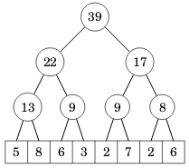

Puun lehtinä ovat taulukon alkiot ja muilla tasoilla jokaisessa solmussa on kahden alemman tason solmun summa.

### Puun tallentaminen

Segmenttipuu tallennetaan taulukkona, jossa on `2n` alkiota, kun `n` on alkuperäisen taulukon koko. Kohdassa 1 on puun juuren alkio, kohdissa 2 ja 3 ovat seuraavan tason alkiot, jne. Alkuperäisen taulukon sisältö alkaa kohdasta `n`.

Esimerkin taulukkoa vastaa seuraava segmenttipuu:

```
int tree[] = {0,39,22,17,13,9,9,8,5,8,6,3,2,7,2,6};
```

Huomaa, että taulukon kohta 0 ei ole käytössä segmenttipuussa.

Tässä tallennustavassa kohdassa `k` olevan solmun vasen lapsi on kohdassa `2k`, oikea lapsi on kohdassa `2k+1` ja vanhempi on kohdassa `k/2` (pyöristys alaspäin kokonaisluvuksi). Tämä on sama tallennustapa kuin binäärikeossa käytetty.

### Alkion muuttaminen

Kun taulukon alkio muuttuu, tämän tulee heijastua kaikkiin puun solmuihin, jotka ovat polulla juuresta alkioon. Esimerkiksi seuraavassa kuvassa alkion 7 muuttuminen vaikuttaa kaikkiin harmaisiin solmuihin:

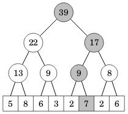

Seuraava koodi toteuttaa alkion muuttamisen:

```cpp
// muuta kohdan k arvoksi x
void change(int k, int x) {
    k += n;
    tree[k] = x;
    for (k /= 2; k >= 1; k /= 2) {
        tree[k] = tree[2*k]+tree[2*k+1];
    }
}
```

Koodi vie aikaa `O(log n)`, koska puussa on logaritminen määrä tasoja.

### Välikysely

Välikyselyssä väli muodostetaan mahdollisimman korkealla puussa olevista solmuista. Esimerkiksi kun haluamme laskea välin `[6,3,2,7,2,6]` summan, saamme sen kahdesta ylemmästä solmusta laskemalla `9+17=26`:

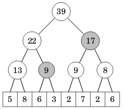

Seuraava koodi laskee summan annetun välin alkioiden summan:

```cpp
// laske välin a...b alkioiden summa
int getSum(int a, int b) {
    a += n; b += n;
    int s = 0;
    while (a <= b) {
        if (a%2 == 1) s += tree[a++];
        if (b%2 == 0) s += tree[b--];
        a /= 2; b /= 2;
    }
    return s;
}
```

Koodi käy läpi puun tasoja pohjalta alkaen ja lisää vasemman ja oikean alkion summaan, jos ylemmän tason solmu on välin ulkopuolella. Koodi vie aikaa `O(log n)`, koska tasojen määrä on logaritminen.

### Muut kyselyt

Segmenttipuun avulla voi toteuttaa tehokkaasti minkä tahansa kyselyn, jossa kyselyn vastauksen voi laskea jakamalla välin kahteen osaan ja yhdistämällä kummankin osan kyselyjen vastaukset.

Esimerkiksi seuraavan segmenttipuun avulla voi etsiä välin pienimmän alkion. Ideana on, että jokaisessa solmussa on minimi sen kahden lapsen arvoista.

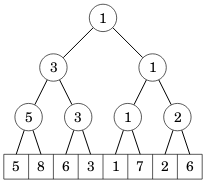

Tällaista puuta voi käsitellä näillä funktioilla:

```cpp
// muuta kohdan k arvoksi x
void change(int k, int x) {
    k += n;
    tree[k] = x;
    for (k /= 2; k >= 1; k /= 2) {
        tree[k] = min(tree[2*k], tree[2*k+1]);
    }
}

// etsi välin a...b pienin alkio
int getMin(int a, int b) {
    a += n; b += n;
    int x = tree[a];
    while (a <= b) {
        if (a%2 == 1) x = min(x, tree[a++]);
        if (b%2 == 0) x = min(x, tree[b--]);
        a /= 2; b /= 2;
    }
    return x;
}
```

### Binäärihaku puussa

Segmenttipuuta voi myös käsitellä binäärihaun tyylisesti aloittamalla haku puun juuresta ja liikkumalla joka askeleella alaspäin vasemmalle tai oikealle.

Seuraava kuva näyttää esimerkin, kuinka äskeisestä puusta voi löytää tehokkaasti pienimmän alkion:

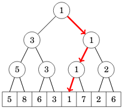

Vastaavalla tavalla voi esimerkiksi ylläpitää taulukkoa, jossa jokainen arvo on bitti 0 tai 1, ja etsiä summien avulla, missä on `k`:nnes bitti 1.

### Tehtävät

* [Dynamic Range Sum Queries](https://cses.fi/alon/task/1648)
* [Dynamic Range Minimum Queries](https://cses.fi/alon/task/1649)
* [Hotel Queries](https://cses.fi/alon/task/1143)
* [List Removals](https://cses.fi/alon/task/1749)
* [Increasing Subsequence](https://cses.fi/alon/task/1145)
* [Range Update Queries](https://cses.fi/alon/task/1651)
* [Nested Ranges Count](https://cses.fi/alon/task/2169)
* [Distinct Values Queries](https://cses.fi/alon/task/1734)

## Verkkoalgoritmit

Usein hyvä tapa tallentaa verkko C++:ssa on käyttää vieruslistaesitystä, joka toteutetaan taulukkona vektoreita. Esimerkiksi verkko


voidaan määritellä näin:

```cpp
vector<int> graph[6];
graph[1].push_back(2);
graph[1].push_back(3);
graph[1].push_back(4);
graph[2].push_back(1);
graph[2].push_back(4);
graph[2].push_back(5);
graph[3].push_back(1);
graph[3].push_back(4);
graph[4].push_back(1);
graph[4].push_back(2);
graph[4].push_back(3);
graph[4].push_back(5);
graph[5].push_back(2);
graph[5].push_back(4);
```

[Tirakirjan](https://www.cs.helsinki.fi/u/ahslaaks/tirakirja/) luvuissa 10–14 käsitellään verkkojen perusasioita, jotka ovat tämän kurssin esitietoina.

### Eulerin kierros

Eulerin kierros on verkossa oleva polku, joka alkaa jostain solmusta, kulkee tasan kerran jokaisen kaaren kautta ja palaa lopuksi alkusolmuun. Suuntaamattomassa verkossa on Eulerin kierros tarkalleen silloin, kun verkko on yhtenäinen ja jokaisen solmun aste on parillinen.

Eulerin kierros voidaan etsiä tehokkaasti Hierholzerin algoritmilla. Siinä ideana on muodostaa Eulerin kierros alikierroksista. Ensin muodostetaan jokin alikierros, joka alkaa tietystä solmusta ja palaa samaan solmuun. Tämän jälkeen kierrosta täydennetään lisäämällä siihen uusia alikierroksia, joiden alkusolmu kuuluu kierrokseen ja joiden kaaret eivät kuulu vielä kierrokseen. Lopulta kaikki kaaret kuuluvat kierrokseen, jolloin Eulerin kierros on valmis. Huomaa, että alikierros voidaan aina muodostaa sen ansiosta, että jokaisen solmun aste on parillinen.

Seuraava esimerkki näyttää, kuinka Eulerin kierros voidaan muodostaa kolmesta alikierroksesta. Ensimmäinen alikierros on 1→2→3→1, toinen alikierros on 2→5→6→2 ja kolmas alikierros on 6→3→4→7→6. Näistä muodostuu Eulerin kierros 1→2→5→6→3→4→7→6→2→3→1.

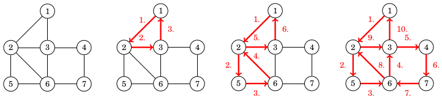

### Funktionaalinen verkko

Funktionaalinen verkko on suunnattu verkko, jossa jokaisesta solmusta lähtee tasan yksi kaari. Seuraavassa on esimerkki funktionaalisesta verkosta:

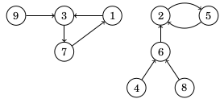

Funktionaalinen verkko voidaan esittää funktiona, joka kuvaa, mihin solmuun mistäkin solmusta pääsee yhdellä askeleella. Esimerkiksi yllä olevaa verkkoa vastaavassa funktiossa `f(1)=3`, `f(2)=5`, `f(3)=7` jne. Funktionaalinen verkko muodostuu aina yhdestä tai useammasta komponentista, jossa on sykli ja siihen johtavia polkuja.

Tehokas tapa käsitellä funktionaalista verkkoa on muodostaa _hyppytaulukko_, joka kertoo jokaiselle solmulle, mihin solmuun siitä pääsee kulkemalla 2:n potenssin verran askelia. Merkitään `g(x,k)` solmua, johon pääsee solmusta `x` kulkemalla `2^k` askelta. Nyt pohjatapauksena on `g(x,0)=f(x)` ja muut arvot saadaan laskettua rekursiivisesti kaavalla `g(x,k)=g(g(x,k-1),k-1)`. Nämä kaikki arvot voidaan tallentaa muistiin taulukkoon sopivaan `k`:n ylärajaan asti.

Hyppytaulukon hyötynä on, että mikä tahansa askelten määrä voidaan esittää summana 2:n potensseja niin, että summassa on logaritminen määrä osia. Esimerkiksi jos askelten määrä on 26, tämä vastaa summaa 16 + 8 + 2. Tässä tapauksessa 26 askeleen päässä solmusta `x` oleva solmu on `g(g(g(x,4),3),1)` eli riittää lukea hyppytaulukosta kolme arvoa.

### Saavutettavat solmut

Annettuna on syklitön suunnattu verkko ja haluamme laskea jokaiselle solmulle saavutettavien solmujen määrän eli moneenko eri solmuun on mahdollista päästä aloittamalla solmusta ja kulkemalla verkossa kaaria pitkin.

Tämä tuntuu dynaamisen ohjelmoinnin tyyliseltä ongelmalta, mutta vaikeutena on, että samaan solmuun voi päästä useaa reittiä. Tämän takia ei riitä käydä läpi solmusta lähteviä kaaria ja laskea yhteen saavutettavien solmujen määriä.

Toimiva ratkaisu syntyy tallentamalla jokaiseen solmuun lista kaikista saavutettavista solmuista. Tämän avulla dynaaminen ohjelmointi voidaan toteuttaa luotettavasti, koska voidaan pitää huolta siitä, että samaa solmua ei lasketa monta kertaa.

Tehokas tapa toteuttaa ratkaisu on tallentaa saavutettavat solmut bitteinä. Tällöin jokaiseen solmuun tallennetaan `n` bittiä ja bitti 1 tarkoittaa, että solmusta on polku kyseiseen solmuun. C++:ssa tämä onnistuu kätevästi `bitset`-rakenteen avulla. Esimerkiksi seuraava koodi luo joukot `a` ja `b` ja yhdistää niiden sisällön joukoksi `c`.

```cpp
bitset<8> a, b, c;
a[0] = 1;
a[5] = 1;
a[6] = 1;
cout << a << "\n"; // 01100001
b[2] = 1;
b[6] = 1;
cout << b << "\n"; // 01000100
c = a|b;
cout << c << "\n"; // 01100101
```

### Sillat ja artikulaatiopisteet

Verkko on _2-yhtenäinen_, jos se säilyy yhtenäisenä, vaikka siitä poistetaan mikä tahansa yksittäinen solmu ja siihen liittyvät kaaret. Esimerkiksi seuraavassa kuvassa vasen verkko on 2-yhtenäinen, mutta oikea verkko ei ole, koska solmun 3 poistaminen jakaa sen kahteen osaan.


Verkossa oleva kaari on _silta_, jos sen poistaminen jakaa verkon osiin, ja verkossa oleva solmu on _artikulaatiopiste_, jos sen poistaminen jakaa verkon osiin. Esimerkiksi seuraavassa verkossa kaaret 4–5 ja 7–8 ovat siltoja ja solmut 4, 5 ja 7 ovat artikulaatiopisteitä.

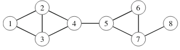

Kun syvyyshaku käy läpi verkon solmut tietystä solmusta alkaen, syntyy puu, jonka avulla verkon kaaria voidaan luokitella. Jokainen kaari on joko _puukaari_, joka kulkee uuteen solmuun, tai _takautuva kaari_, joka palaa takaisin aiempaan solmuun.

Seuraavassa kuvassa on verkko ja sitä vastaava puu solmusta 1 alkaen. Yhtenäiset viivat kuvaavat puukaaret ja katkoviivat kuvaavat takautuvat kaaret.

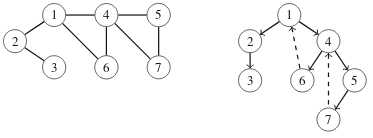

Voimme tunnistaa syvyyshaun tuottamasta puusta verkon sillat ja artikulaatiopisteet. Tarkastellaan seuraavaa puuta, joka vastaa ylempänä esiintynyttä verkkoa:

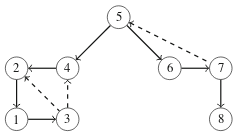

Puussa oleva kaari _a_→_b_ vastaa siltaa, jos se on puukaari eikä solmun _b_ alipuusta ole takautuvaa kaarta solmuun _a_ eikä mihinkään solmun _a_ esivanhempaan. Yllä olevassa verkossa esimerkiksi kaari 5→4 vastaa siltaa, koska solmun 4 alipuusta ei ole takautuvaa kaarta solmuun 5 eikä sen esivanhempaan.

Puussa oleva solmu _x_ on artikulaatiopiste kahdessa tapauksessa. Ensinnäkin jos solmu _x_ on juuri, se on artikulaatiopiste tarkalleen silloin, kun sillä on kaksi tai useampia lapsia. Jos taas solmu _x_ ei ole juuri, se on artikulaatiopiste, jos sillä on lapsi, jonka alipuussa ei ole takautuvaa kaarta solmun _x_ esivanhempaan. Yllä olevassa verkossa solmu 5 on artikulaatiopiste, koska se on juuri ja sillä on kaksi lasta. Solmu 4 on puolestaan artikulaatiopiste sen vuoksi, että sen lapsen 2 alipuussa ei ole takautuvaa solmua solmun 4 esivanhempaan.

Tällä tavalla voimme etsiä sekä verkon sillat että artikulaatiopisteet tehokkaasti lineaarisessa ajassa suorittamalla syvyyshaun jostakin solmusta.

### Tehtävät

* [Building Roads](https://cses.fi/alon/task/1666)
* [Flight Discount](https://cses.fi/alon/task/1195)
* [Investigation](https://cses.fi/alon/task/1202)
* [Mail Delivery](https://cses.fi/alon/task/1691)
* [Planets Queries I](https://cses.fi/alon/task/1750)
* [Planets Queries II](https://cses.fi/alon/task/1160)
* [Reachable Nodes](https://cses.fi/alon/task/2138)
* [Necessary Roads](https://cses.fi/alon/task/2076)
* [Necessary Cities](https://cses.fi/alon/task/2077)

## Puualgoritmit

Puu on yhtenäinen ja syklitön verkko, jossa on `n` solmua ja `n-1` kaarta. Puussa jokaisen kahden solmun välillä on yksikäsitteinen polku.

### Esimerkki

Tässä on esimerkkinä puu, jossa on 6 solmua ja 5 kaarta:


Yleensä hyvä tapa tallentaa puu on vieruslistaesitys luomalla taulukko, jossa on vektoreita. Esimerkiksi voimme tallentaa yllä olevan puun näin:

```cpp
vector<int> tree[7];
tree[1].push_back(2);
tree[1].push_back(3);
tree[1].push_back(4);
tree[2].push_back(1);
tree[2].push_back(5);
tree[2].push_back(6);
tree[3].push_back(1);
tree[4].push_back(1);
tree[5].push_back(2);
tree[6].push_back(2);
```

### Juurtaminen

Puun käsittelyä helpottaa usein, jos valitsemme yhden sen solmuista juureksi. Tyypillisesti valitsemme juureksi solmun 1.

Esimerkiksi äskeinen puumme näyttää juurrettuna tältä:

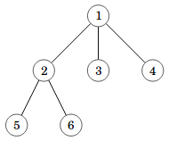

Tämän jälkeen puun solmut asettuvat tasoittain juuren alapuolelle, ja jokaisesta solmusta alkaa alipuu, jonka juurena se on.

### Läpikäynti

Voimme käydä läpi kaikki puun solmut juuresta alkaen syvyyshaulla. Esimerkiksi seuraava funktio tulostaa kaikki puun solmut:

```cpp
void dfs(int node, int prev) {
    cout << node << "\n";
    for (auto next : tree[node]) {
        if (next == prev) continue;
        dfs(next, node);
    }
}
```

Tulostaminen alkaa kutsumalla funktiota `dfs(1,0)`. Parametri `node` on nykyinen solmu ja parametri `prev` on edellinen solmu. Läpikäynti etenee kaikkiin solmuihin edellistä solmua lukuun ottamatta. Tässä tapauksessa solmut tulostetaan järjestyksessä 1, 2, 5, 6, 3, 4.

### Dynaaminen ohjelmointi

Voimme laskea läpikäynnin yhteydessä puun solmuihin tietoa dynaamisella ohjelmoinnilla. Esimerkiksi seuraava koodi luo taulukon `count`, joka kertoo jokaiselle solmulle, montako solmua sen alipuussa on:

```cpp
void dfs(int node, int prev) {
    count[node] = 1;
    for (auto next : tree[node]) {
        if (next == prev) continue;
        dfs(next, node);
        count[node] += count[next];
    }
}
```

Seuraava koodi puolestaan laskee jokaisesta solmusta taulukkoon `length`, kuinka pitkä on pisin solmusta alaspäin lähtevä polku:

```cpp
void dfs(int node, int prev) {
    length[node] = 0;
    for (auto next : tree[node]) {
        if (next == prev) continue;
        dfs(next, node);
        length[node] = max(length[node], length[next]+1);
    }
}
```

Dynaamisen ohjelmoinnin avulla voidaan laskea tehokkaasti esimerkiksi puun _läpimitta_ eli suurin etäisyys kahden solmun välillä tai yleisemmin jokaiseen solmuun suurin etäisyys toiseen solmuun. Tällaisissa tehtävissä voi auttaa laskea jokaiseen solmuun useita etäisyyksiä, kuten kuinka pitkiä ovat kaksi pisintä polkua solmusta alaspäin kahteen eri suuntaan.

### Esivanhemman etsiminen

Tavallinen kysely puussa on selvittää solmun esivanhempi, johon pääsee kulkemalla tasoja ylöspäin puussa. Merkitään `f(x,k)` solmun `x` esivanhempaa `k` tasoa ylempänä. Esimerkiksi seuraavassa kuvassa `f(2,1)=1` ja `f(8,2)=4`.

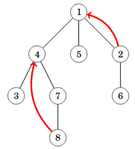

Voimme vastata tällaisiin kyselyihin tehokkaasti `O(log n)`-ajassa hyppytaulukon avulla. Esikäsittely vie aikaa `O(n log n)`.

### Alin yhteinen esivanhempi

Solmujen `a` ja `b` alin yhteinen esivanhempi on alin puun solmu, joka on kummankin solmun esivanhempi. Esimerkiksi seuraavassa kuvassa solmujen 5 ja 8 alin yhteinen esivanhempi on solmu 2.

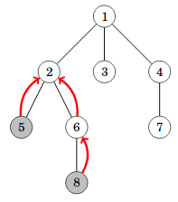

Pystymme selvittämään alimman yhteisen esivanhemman tehokkaasti kahdessa vaiheessa. Ensin nostamme alemman tason solmua ylöspäin niin, että molemmat solmut ovat samalla tasolla. Tämän jälkeen nostamme solmuja yhtä aikaa ylöspäin, kunnes ne törmäävät. Molemmat vaiheet onnistuvat ajassa `O(log n)` hyppytaulukon avulla.

### Etäisyydet puussa

Kun meillä on keino selvittää tehokkaasti kahden solmun alin yhteinen esivanhempi, voimme myös laskea tehokkaasti kahden solmun etäisyyden eli niiden välillä olevan polun pituuden.

Oletetaan, että solmut ovat `a` ja `b` ja niiden alin yhteinen esivanhempi on `c`. Merkitään lisäksi `d(x)` solmun `x` syvyyttä. Voimme laskea näiden tietojen perusteella solmujen `a` ja `b` etäisyyden kaavalla `d(a)+d(b)-2*d(c)`.

### Puiden isomorfisuus

Kaksi verkkoa ovat isomorfiset, jos ne ovat rakenteeltaan samanlaiset, kun ei kiinnitetä huomiota solmujen numerointiin. Yleisessä tapauksessa verkkojen isomorfisuuden tarkastaminen on vaikeaa, mutta kun verkot ovat puita, tämä onnistuu tehokkaasti.

Puiden isomorfisuus voidaan selvittää muodostamalla kummallekin puulle tunniste, joka ei riipu solmujen numeroinnista. Jos tunnisteet ovat samat, puut ovat isomorfiset, ja muuten puut eivät ole isomorfiset. 

Tarkastellaan ensin tilannetta, jossa puilla on juuri. Tällöin voimme laskea tunnisteen rekursiivisesti niin, että kunkin alipuun tunniste määräytyy sen lasten tunnisteiden perustella. Tunniste voidaan laskea näin:

* Jos alipuu on lehti, sen tunniste on 1.
* Muuten kerätään listaan kaikki solmun alipuiden tunnisteet ja järjestetään lista. Jos tälle listalle on jo tunniste, käytetään sitä. Muuten annetaan listalle seuraava vapaana oleva tunniste.

Nyt voimme laskea tunnisteen seuraavalle puulle:


Tässä puussa solmut 3, 4, 5 ja 6 ovat lehtiä, joten näissä solmuissa tunniste on 1. Solmussa 2 alipuiden tunnisteet ovat [1, 1], joten tämä lista saa tunnisteen 2. Solmussa 1 alipuiden tunnisteet puolestaan ovat [1, 1, 2], joten tämä lista saa tunnisteen 3. Koko puun tunniste on siis 3.

Tällä tavalla laskettuna kaksi isomorfista puuta saavat aina saman tunnisteen, koska lasten tunnisteet järjestetään ja samanlainen lista saa aina saman tunnisteen. Niinpä riittää laskea tunniste kummallekin puulle ja tarkastaa, ovatko tunnisteet samat. Huomaa, että kun jälkimmäisen puun tunnisteet lasketaan, käytetään samoja listojen tunnisteita kuin ensimmäisessä puussa lasketut.

Vaikeampi tehtävä on selvittää puiden isomorfisuus silloin, kun puilla ei ole juuria. Tämä onnistuu kuitenkin valitsemalla puille juuret sopivasti ja käyttämällä sitten äskeistä tekniikkaa.

Puun solmu on keskussolmu (centroid), jos jokaisessa alipuussa on enintään `n/2` solmua, jos kyseinen solmu valitaan puun juureksi. Puun keskussolmut voidaan löytää valitsemalla puulle juureksi mikä tahansa solmu ja laskemalla jokaiseen solmuun kunkin alipuun solmujen määrä. Tämän avulla voidaan päätellä, mitkä solmut ovat keskussolmuja.

Voidaan todistaa, että puussa on aina vähintään yksi keskussolmu ja enintään kaksi keskussolmua. Tämän ansiosta voimme käydä läpi eri tavat valita keskussolmut juureksi ja tutkia puiden isomorfisuus kaikissa näissä tapauksissa. Tapauksia on yhteensä enintään neljä, eli algoritmi on tehokas.

### Tehtävät

* [Tree Diameter](https://cses.fi/alon/task/1131)
* [Tree Distances I](https://cses.fi/alon/task/1132)
* [Tree Distances II](https://cses.fi/alon/task/1133)
* [Company Queries I](https://cses.fi/alon/task/1687)
* [Company Queries II](https://cses.fi/alon/task/1688)
* [Distance Queries](https://cses.fi/alon/task/1135)
* [Tree Isomorphism I](https://cses.fi/alon/task/1700)
* [Finding a Centroid](https://cses.fi/alon/task/2079)
* [Tree Isomorphism II](https://cses.fi/alon/task/1701)

## Matematiikka

### Eratostheneen seula

Eratostheneen seula on tehokas tapa etsiä kaikki alkuluvut 1:n ja `n`:n väliltä. Seulan voi toteuttaa seuraavasti:

```cpp
for (int i = 2; i <= n; i++) {
    if (sieve[i]) continue;
    for (int j = 2*i; j <= n; j += i) {
        sieve[j] = 1;
    }
}
```

Algoritmin päätteeksi `sieve[x]` kertoo, onko luku `x` alkuluku. Arvo 0 tarkoittaa, että luku on alkuluku, ja arvo 1 tarkoittaa, että luku ei ole alkuluku. Ideana on, että aina kun vastaan tulee alkuluku, kaikki sen moninkerrat merkitään ei-alkuluvuiksi.

Vaikka algoritmissa on kaksi silmukkaa sisäkkäin, se toimii hyvin tehokkaasti. Yläraja algoritmin ajankäytölle saadaan siitä, että sisempää silmukkaa suoritetaan enintään `n/2+n/3+n/4+...` kertaa. Tämä on harmoninen summa, joka on luokkaa `O(n log n)`.

Muuttamalla algoritmia niin, että silmukan sisällä asetetaan `sieve[j] = i`, algoritmin jälkeen voi myös tehokkaasti etsiä luvun esityksen alkulukuina, koska silloin `sieve[x]` kertoo jonkin luvun `x` alkutekijän, jos luku ei ole alkuluku.

Tällainen algoritmin runko on hyödyllinen joskus muissakin tehtävissä, koska voidaan käydä läpi kaikki moninkerrat ja tuloksena on algoritmi, joka vie aikaa `O(n log n)`.

### Modulolaskenta

Merkintä `x mod m` tarkoittaa lukua `x` modulo `m` eli `x`:n jakojäännöstä `m`:llä. Esimerkiksi `8 mod 3 = 2`. Ohjelmoinnissa käytetään yleensä merkkiä `%` modulon laskemiseen.

Tavallisia kaavoja ovat `(a+b) mod m = ((a mod m) + (b mod m)) mod m` ja `(a*b) mod m = ((a mod m) * (b mod m)) mod m`. Näiden avulla ohjelmoinnissa voidaan laskea usein suuri tulos modulo `m` tehokkaasti käyttäen tavallisia lukutyyppejä (kuten `int` tai `long`).

Potenssi `a^b mod m` voidaan laskea tehokkaasti ottamalla huomioon kaksi tapausta. Jos `b` on parillinen, voidaan laskea ensin `x = a^(b/2) mod m` ja sitten `(x*x) mod m`, mikä puolittaa ongelman koon. Jos `b` on pariton, lasketaan vain `x = a^(b-1) mod m` ja sitten `(x*a) mod m`. Tuloksena on algoritmi, joka suorittaa yhteensä vain `O(log b)` askelta.

Myös jakolasku voidaan laskea tietyissä tapauksissa modulo `m`. Ideana on esittää lasku `(a/b) mod m` muodossa `((a mod m) * inv_m(b)) mod m`, missä `inv_m` tarkoittaa käänteisalkiota modulo `m`. Jos `m` on alkuluku, tämän saa laskettua kaavalla `inv_m(b) = b^(m-2) mod m`. Esimerkiksi `(100/4) mod 13` voidaan laskea `((100 mod 13) * inv_13(4)) mod 13`. Tässä `100 mod 13 = 9` ja `inv_13(4) = 4^11 mod 13 = 10`, eli tulos on `(9*10) mod 13 = 12`.

### Binomikerroin

Binomikerroin `ncr(n,k)` ilmaisee, monellako tavalla `n` alkion joukosta voidaan valita `k` alkion osajoukko. Esimerkiksi `ncr(5,2)=10`, koska joukosta {1,2,3,4,5} voidaan muodostaa osajoukot {1,2}, {1,3}, {1,4}, {1,5}, {2,3}, {2,4}, {2,5}, {3,4}, {3,5} ja {4,5}.

Tavallinen tapa laskea binomikerroin on käyttää kaavaa `ncr(n,k) = n!/(k!*(n-k)!)`. Esimerkiksi `ncr(5,2)=5!/(2!*3!)=10`. Tämän voi laskea tehokkaasti suurillekin luvuille modulo `m`, jos lasketaan etukäteen kaikki tarvittavat kertomat.

Binomikerroin on hyödyllinen työkalu kombinatoriikassa sen monien sovellusten ansiosta. Esimerkiksi `ncr(n,k)` ilmaisee, monessako `n`-pituisessa bittijonossa on tasan `k` ykkösbittiä tai montako tapaa on jakaa `k` palloa `n` laatikkoon niin, että jokaisessa laatikossa on enintään yksi pallo. Vaikeampi tehtävä on laskea, monellako tavalla pallot voidaan jakaa laatikoihin niin, että samassa laatikossa voi olla montakin palloa ja kaksi tapaa ovat erilaiset, jos jossakin laatikossa on eri määrä palloja. Vastaus tähän on `ncr(n+k-1,k)`, koska jokainen tapa voidaan esittää bittijonona, jonka pituus on `n+k-1` merkkiä ja jossa on tasan `k` ykkösbittiä. Tällainen bittijono kuvaa prosessin, jolla pallot sijoitetaan vasemmasta laatikosta aloittaen. Merkki 0 tarkoittaa "siirry seuraavaan laatikkoon oikealle" ja merkki 1 tarkoittaa "laita yksi pallo tähän laatikkoon".

### Nim-peli

Nim on kahden pelaajan peli, jossa on `n` pinoa kolikoita. Pelaajat tekevät vuorotellen siirtoja ja joka siirrolla pelaajan tulee valita jokin epätyhjä pino ja poistaa siitä jokin määrä kolikoita. Peli päättyy, kun kaikki kolikot on poistettu, jolloin pelin voittaja on se, joka teki viimeisen siirron.

Pelin tila voidaan esittää listana lukuja. Esimerkiksi `[4,1,8]` tarkoittaa peliä, jossa `n=3` ja pinoissa on 4, 1 ja 8 kolikkoa. Tila on voittotila, jos siitä aloittava pelaaja pystyy voittamaan pelin oikein pelaamalla, ja häviötila, jos pelaaja häviää varmasti, jos vastustaja pelaa oikein. Jokainen tila on joko voittotila tai häviötila.

Osoittautuu, että tilan laatu voidaan selvittää laskemalla xor-summa kolikoiden määrästä. Jos xor-summa on 0, tila on häviötila, ja muuten tila on voittotila. Esimerkiksi pelissä `[4,1,8]` xor-summa on `4 xor 1 xor 8 = 13`, mikä tarkoittaa, että tila on voittotila. Tällöin pelaaja voi tehdä siirron, joka johtaa häviötilaan. Tässä tapauksessa sopiva siirto olisi poistaa 3 kolikkoa viimeisestä pinosta, jolloin tilaksi tulee `[4,1,5]`. Tämä on häviötila, koska `4 xor 1 xor 5 = 0`.

Nimin tyylisesti voidaan pelata monia muitakin pelejä esittämällä osapelit samaan tapaan kuin kolikkopinot. Ideana on, että osapelin jokaisella tilalla on tietty luku, joka vastaa kolikoiden määrää nimin pinossa. Luku on pienin ei-negatiivinen kokonaisluku, jota ei ole millään toisella tilalla, johon pääsee kyseisestä tilasta tekemällä yhden siirron.

### Tehtävät

* [Counting Divisors](https://cses.fi/alon/task/1713)
* [Common Divisors](https://cses.fi/alon/task/1081)
* [Binomial Coefficients](https://cses.fi/alon/task/1079)
* [Creating Strings II](https://cses.fi/alon/task/1715)
* [Distributing Apples](https://cses.fi/alon/task/1716)
* [Nim Game I](https://cses.fi/alon/task/1730)
* [Nim Game II](https://cses.fi/alon/task/1098)
* [Stair Game](https://cses.fi/alon/task/1099)

## Merkkijonot

### Z-algoritmi

Z-algoritmi on `O(n)`-aikainen algoritmi, joka muodostaa merkkijonoa vastaavan Z-taulukon. Jokainen tässä taulukossa oleva luku kertoo, montako merkkiä siitä kohdasta alkava merkkijono täsmää merkkijonon alun kanssa.

Tarkastellaan esimerkkinä merkkijonoa `ABABCABABCB`. Tämän merkkijonon Z-taulukko on seuraavanlainen:

```
A B A B C A B A B C B
- 0 2 0 0 5 0 2 0 0 0
```

Esimerkiksi taulukossa on toisen `A`:n kohdalla on luku 2, koska täsmäävä alkuosa on `AB`, jonka pituus on 2.

Z-algoritmi vertaa joka kohdassa taulukon alkuosaa ja kyseisestä kohdasta alkavaa merkkijonoa merkki kerrallaan. Tavallisesti toteutettuna tämä veisi aikaa `O(n²)`, mutta algoritmissa on yksi tärkeä optimointi, jonka ansiosta aikaa kuluu vain `O(n)`.

Ideana on pitää yllä tietoa siitä, mikä on tähän mennessä pisimmälle merkkijonossa yltänyt täsmäävä osa (oikea reuna), ja hyödyntää tätä tietoa seuraavien arvojen laskemisessa. Tarkastellaan esimerkkinä tilannetta, jossa olemme laskeneet seuraavat arvot taulukkoon:

```
A B A B C A B A B C B
- 0 2 0 0 5 0 ? ? ? ?
```

Tässä vaiheessa meillä on tietona, että 5:n pituinen täsmäävä osuus ulottuu merkkijonon toiseksi viimeiseen merkkiin asti. Niinpä voimme päätellä suoraan (vertaamatta merkkejä yksi kerrallaan), että seuraava luku on 2, koska vastaavassa kohdassa taulukon alussa on luku 2:

```
A B A B C A B A B C B
- 0 2 0 0 5 0 2 ? ? ?
```

Vastaavalla tavalla voimme päätellä myös kaksi seuraavaa lukua:

```
A B A B C A B A B C B
- 0 2 0 0 5 0 2 0 0 ?
```

Viimeisen luvun kohdalla meidän täytyy jälleen verrata merkkejä yksi kerrallaan, koska meillä ei ole aiempaa tietoa tästä merkkijonon osasta. Koska ensimmäiset merkit eivät täsmää, tuloksena on seuraava taulukko:

```
A B A B C A B A B C B
- 0 2 0 0 5 0 2 0 0 0
```

Aina kun vertaamme merkkejä yksi kerrallaan, muistissa oleva oikea reuna liikkuu, joten algoritmi vie aikaa vain `O(n)`.

Z-algoritmin avulla voidaan ratkaista tehokkaasti monia merkkijonotehtäviä. Tarkastellaan esimerkkinä tehtävää, jossa haluamme laskea, montako kertaa merkkijonon _A_ osana esiintyy merkkijono _B_. Tämä selviää muodostamalla Z-taulukko merkkijonolle _BA_ ja tutkimalla, monessako kohdassa _A_:n alueella taulukon arvo on _B_:n pituus tai suurempi.

### Suffiksitaulukko

Suffiksitaulukko on tietorakenne, joka osoittaa merkkijonon osajonojen järjestyksen. Jokainen suffiksitaulukon alkio vastaa osajonoa, joka alkaa tietystä merkkijonon kohdasta ja päättyy merkkijonon loppuun (eli osajono on merkkijonon loppuosa eli suffiksi).

Esimerkiksi merkkijonon `ABACABACAC` suffiksitaulukko on seuraava:

```
0 4 8 2 6 1 5 9 3 7
```

Seuraavassa näkyy, miten suffiksitaulukko ilmaisee osajonojen järjestyksen:

```
0 ABACABACAC
4 ABACAC
8 AC
2 ACABACAC
6 ACAC
1 BACABACAC
5 BACAC
9 C
3 CABACAC
7 CAC
```

Suffiksitaulukon ja binäärihaun avulla voidaan etsiä ajassa `O(k log n)` kohdat, joissa tietty `k`-merkkinen osajono esiintyy merkkijonossa. Esimerkiksi jos haettavana on merkkijono `AC`, ensin etsitään alue, jossa osajono alkaa merkillä `A`:

```
0 ABACABACAC
4 ABACAC
8 AC
2 ACABACAC
6 ACAC
```

Tämän jälkeen tätä aluetta rajataan vielä niin, että toisen merkin tulee olla `C`:

```
8 AC
2 ACABACAC
6 ACAC
```

Tämän perusteella tiedetään, että merkkijono `AC` esiintyy kolmesti merkkijonon osajonona. Lisäksi voitaisiin hakea tehokkaasti ensimmäinen esiintymiskohta esimerkiksi yhdistämällä suffiksitaulukkoon segmenttipuu, joka antaa välin minimin.

Mutta kuinka suffiksitaulukko voidaan luoda tehokkaasti? Yksi kätevä tapa on laskea tunnisteet merkkijonon osajonoille, joiden pituus on 2:n potenssi. Ensin tunnisteet lasketaan 1:n pituisille, sitten 2:n pituisille, sitten 4:n pituisille jne. osajonoille. Jokainen tunniste on yksi luku, joka ilmaisee osajonon järjestyksen muihin samanpituisiin verrattuna.

Aluksi 1:n pituiset tunnisteet voidaan valita suoraan merkkien järjestyksen mukaan:

```
A B A C A B A C A C
1 2 1 3 1 2 1 3 1 3
```

Sitten pidempi tunniste saadaan muodostamalla ensin pari, jossa on kaksi edellisen pituuden tunnistetta, ja antamalla lopuksi pareille järjestyksessä uudet tunnisteet 1, 2, 3, jne. Esimerkiksi kun muodostettavana on 2:n pituiset tunnisteet, parit ovat:

```
 A     B     A     C     A     B     A     C     A     C
(1,2) (2,1) (1,3) (3,1) (1,2) (2,1) (1,3) (3,1) (1,3) (3,0)
```

Huomaa, että viimeisessä parissa jälkimmäinen osa on 0, koska osa on merkkijonon ulkopuolella. Tämän jälkeen pareille annetaan lopulliset tunnisteet järjestyksessä seuraavasti:

* `(1,2) -> 1`
* `(1,3) -> 2`
* `(2,1) -> 3`
* `(3,0) -> 4`
* `(3,1) -> 5`

Niinpä 2:n pituisten osajonojen tunnisteet ovat:

```
A B A C A B A C A C
1 3 2 5 1 3 2 5 2 4
```

Sitten lasketaan vastaavasti 4:n pituiset tunnisteet:

```
 A     B     A     C     A     B     A     C     A     C
(1,2) (3,5) (2,1) (5,3) (1,2) (3,5) (2,2) (5,4) (2,0) (4,0)
```

```
A B A C A B A C A C
1 5 3 7 1 5 4 8 2 6
```

Tämän jälkeen lasketaan vielä 8:n pituiset tunnisteet:

```
 A     B     A     C     A     B     A     C     A     C
(1,1) (5,5) (3,4) (7,8) (1,2) (5,6) (4,0) (8,0) (2,0) (6,0)
```

```
A B A C A B A C  A C
1 6 4 9 2 7 5 10 3 8
```

Nyt jokaisella osajonolla on oma tunniste, minkä avulla voidaan muodostaa suffiksitaulukko lukemalla tunnisteita vastaavat kohdat tunnisteiden järjestyksessä 1, 2, 3, jne.:

```
0 4 8 2 6 1 5 9 3 7
```

Tämän algoritmin aikavaativuus on `O(n log^2 n)`, koska jokaisella osajonolla on eri tunniste `O(log n)` kierroksen jälkeen (kullakin kierroksella lasketaan tietyn pituisten osajonojen tunnisteet) ja kierroksella järjestetään parit ajassa `O(n log n)`.

Suffiksitaulukon muodostamiseen tunnetaan myös tehokkaampia tapoja: jopa `O(n)`-aikaisia algoritmeja on olemassa. Tässä esitetty yksinkertainen menetelmä on kuitenkin melko tehokas ja riittää usein.

Suffiksitaulukon lisäksi jossain ongelmissa hyödyllinen tietorakenne on LCP-taulukko, joka ilmaisee jokaisesta suffiksitaulukossa peräkkäin olevasta merkkijonosta niiden yhteisen alkuosan pituuden. Esimerkiksi merkkijonon `ABACABACAC` LCP-taulukko on seuraava:

```
- 5 1 2 3 0 4 0 1 2
```

Jokainen LCP-taulukon arvo ilmaisee vastaavan suffiksitaulukon kohdan osajonon ja sitä edellisen osajonon yhteisen alkuosan pituuden. Koska ensimmäisessä kohdassa ei ole edellistä osajonoa, siinä kohdassa ei ole arvoa. Seuraavassa näkyy, miten LCP-taulukko liittyy osajonoihin:

```
- ABACABACAC
5 ABACAC
1 AC
2 ACABACAC
3 ACAC
0 BACABACAC
4 BACAC
0 C
1 CABACAC
2 CAC
```

Esimerkiksi osajonon `BACAC` kohdalla on arvo 4, koska alkuosa `BACA` on sama kuin edellisessä osajonossa `BACABACAC`. LCP-taulukon avulla voidaan laskea tehokkaasti esimerkiksi, montako erilaista osajonoa merkkijonossa on, koska taulukko ilmaisee jokaisesta loppuosasta, montako merkkiä alussa on yhteisiä toisen loppuosan kanssa.

Suffiksitaulukon rakentamisen jälkeen LCP-taulukko voidaan muodostaa tehokkaasti ajassa `O(n)`. Tämä on mahdollista muodostamalla taulukko loppuosille järjestyksessä pituuden mukaan pisimmästä lyhimpään. Tällöin taulukon arvojen laskemisessa voidaan hyödyntää aiemmin laskettua tietoa. Kun lasketaan kohdasta `i` alkavan loppuosan LCP-arvo, lähtökohdaksi otetaan kohdasta `i-1` alkavan loppuosan LCP-arvo `x`, joka on jo laskettu aiemmin. Uusi LCP-arvo on ainakin `x-1`, koska siinä on alussa samat merkit ensimmäistä merkkiä lukuun ottamatta. Tämän jälkeen merkkejä vertaillaan yksi kerrallaan, kunnes löytyy eroava merkki tai toinen osajono päättyy.

Tarkastellaan esimerkkinä LCP-arvon laskemista osajonolle `BACAC`. Koska aiemmin on laskettu osajonon `ABACAC` LCP-arvo 5, uusi LCP-arvo on ainakin 4. Tämän jälkeen vertaillaan kohdassa 4 olevaa merkkiä osajonoissa `BACABACAC` ja `BACAC`. Koska merkit ovat `B` ja `C`, ne eroavat ja yhteisen alkuosan pituus on 4.

Tällainen algoritmi vie aikaa `O(n)`, koska jokaisessa kohdassa edellinen arvo vähenee vain yhdellä, mikä rajoittaa tehokkaasti vertailujen määrää.

### Tehtävät

* [String Matching](https://cses.fi/alon/task/1753)
* [Finding Borders](https://cses.fi/alon/task/1732)
* [Minimal Rotation](https://cses.fi/alon/task/1110)
* [Counting Patterns](https://cses.fi/alon/task/2103)
* [Pattern Positions](https://cses.fi/alon/task/2104)
* [Distinct Substrings](https://cses.fi/alon/task/2105)
* [Substring Distribution](https://cses.fi/alon/task/2110)

## Treap-rakenne

Treap on binääripuu, jonka avulla voi toteuttaa merkkijonon tai taulukon, jonka osia pystyy siirtelemään tehokkaasti. Jokaisessa puun solmussa on kaksi arvoa: paino ja sisältö. Jokaisen solmu paino on satunnainen ja sisältö kuvaa taulukon alkiota. Ehtona on, että jokaisessa kohdassa solmu on painavampi tai yhtä painava kuin sen vanhempi.

Treapin sisällön voi tulkita niin, että jokaisessa solmussa vasemman alipuun solmut ovat järjestyksessä ennen solmua ja oikean alipuun solmut ovat järjestyksessä solmun jälkeen. Tällä tavalla voimme tallentaa merkkijonon tai taulukon sisällön treapiin.

Seuraavassa on esimerkkinä treap, joka vastaa merkkijonoa SANDWICH:

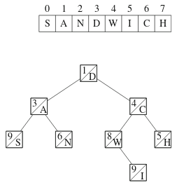

### Operaatiot

Treapin ensimmäinen operaatio on _jakaminen_. Tämä toteutetaan lähtemällä liikkeelle puun juuresta ja siirtämällä puun osia vasempaan ja oikeaan puuhun. Seuraava kuva näyttää tuloksen, kun merkkijono SANDWICH jaetaan osiin SANDW ja ICH:

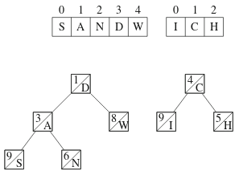

Treapin toinen operaatio on _yhdistäminen_. Tämä tarkoittaa, että kaksi treapia liitetään peräkkäin. Voimme esimerkiksi yhdistää äsken saamamme osat toisin päin, eli ensin ICH ja sitten SANDW:

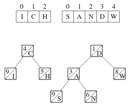

Yhdistämisessä muodostamme uuden treapin, johon valitaan osia vasemmasta ja oikeasta treapista solmujen painojen perusteella. Esimerkissämme tuloksena on seuraava treap:

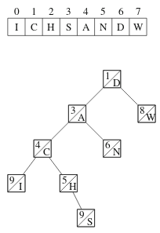

Treapin tehokkuus perustuu siihen, että jokaisessa solmussa on satunnainen paino. Tämän ansiosta kun jakaminen ja yhdistäminen toteutetaan painoehdon mukaisesti, operaatiot vievät aikaa vain `O(log n)`.

Treapin perustoteutukseen on mahdollista yhdistää monia lisäominaisuuksia. Esimerkiksi treapia voi laajentaa niin, että sen pystyy kääntämään tehokkaasti, lisäämällä joka solmuun kentän, joka kertoo, onko vastaava alipuu käännetty. Lisäksi solmuihin voi toteuttaa kaikenlaista laskentaa segmenttipuun tapaisesti.

### Toteutus

Kuinka treap kannattaisi sitten toteuttaa? Tämä on melko mutkikasta, mutta seuraava koodi antaa hyvän pohjan:

```cpp
#include <iostream>

using namespace std;

struct node {
    node *left, *right;
    int weight, size, value;
    node (int v) {
        left = right = NULL;
        weight = rand();
        size = 1;
        value = v;
    }
};

int size(node *treap) {
    if (treap == NULL) return 0;
    return treap->size;
}

void split(node *treap, node *&left, node *&right, int k) {
    if (treap == NULL) {
        left = right = NULL;
    } else {
        if (size(treap->left) < k) {
            split(treap->right, treap->right, right, k-size(treap->left)-1);
            left = treap;
        } else {
            split(treap->left, left, treap->left, k);
            right = treap;
        }
        treap->size = size(treap->left)+size(treap->right)+1;
    }
}

void merge(node *&treap, node *left, node *right) {
    if (left == NULL) treap = right;
    else if (right == NULL) treap = left;
    else {
        if (left->weight < right->weight) {
            merge(left->right, left->right, right);
            treap = left;
        } else {
            merge(right->left, left, right->left);
            treap = right;
        }
        treap->size = size(treap->left)+size(treap->right)+1;
    }
}

void print(node *treap) {
    if (treap == NULL) return;
    print(treap->left);
    cout << treap->value << " ";
    print(treap->right);
}

int main() {
    // luo treap taulukolle [1,2,3,4,5,6,7,8]
    node *treap = NULL;
    merge(treap,treap,new node(1));
    merge(treap,treap,new node(2));
    merge(treap,treap,new node(3));
    merge(treap,treap,new node(4));
    merge(treap,treap,new node(5));
    merge(treap,treap,new node(6));
    merge(treap,treap,new node(7));
    merge(treap,treap,new node(8));
    print(treap);
    cout << "\n";
    // jaa taulukko osiin [1,2,3,4] ja [5,6,7,8] ja yhdistä ne uudestaan taulukoksi [5,6,7,8,1,2,3,4]
    node *left, *right;
    split(treap,left,right,4);
    merge(treap,right,left);
    print(treap);
    cout << "\n";
}
```

### Tehtävät

* [Cut and Paste](https://cses.fi/alon/task/2072)
* [Substring Reversals](https://cses.fi/alon/task/2073)
